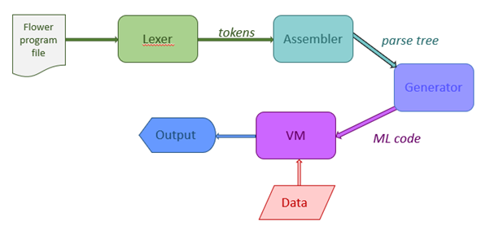
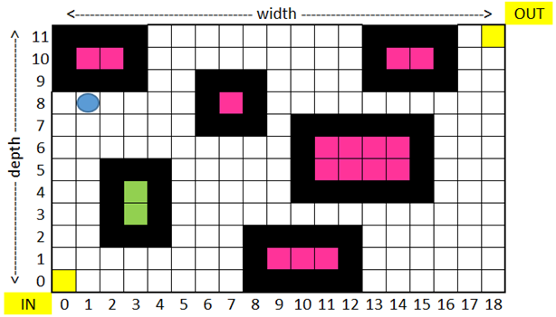

# Flower Programming Language Project

> ⚠️ This is an archived project from Fall 2022, preserved for reference. No active development is planned.

This project was developed as part of the Languages & Compilers course during Fall 2022.

**Team Members:**
- Mouad Kabiri
- Amine Nakari
- El Mehdi Ziate

---



Figure 1: The complete compiler pipeline for the Flower language, showing:

- Input: Flower program file
- Lexer: Produces tokens
- Assembler (Parser): Creates parse tree
- Generator: Produces ML code
- VM: Executes the code with data input
- Output: Program results*

## Overview
This project involves designing and implementing a simple task-oriented programming language called **Flower**. The language is used to write programs that direct a **Picker** agent to navigate through a two-dimensional **World** grid, picking flowers to gather in a bouquet.

The project is divided into multiple parts:
1. Virtual Machine Interpreter
2. Language Design
3. Lexical Analyzer
4. Parser & Static Semantics Analyzer
5. Code Generator

---

## Part 1: Virtual Machine Interpreter

### Purpose
Implement a virtual machine (VM) that executes a simple machine language (VML) similar to the one studied in Module 3.

### Specifications
- Memory: 1000-word memory for both data and code
- Word Format: Signed 10-digit words
- Instruction Format: 1-digit signed opcode and 3-digit operands

### Implementation Details
#### Required Components
1. Memory Arrays
   - Data memory array (1000 words)
   - Code memory array (1000 words)
   - Support for signed 10-digit integers

2. Symbol Table
   - Maps "numeric symbolic" names to data memory locations
   - Built during program loading
   - Used for resolving data references in instructions

3. Label Table
   - Maps "numeric symbolic" labels to code memory locations
   - Built during program loading
   - Used for resolving jump targets

4. Program Loader
   - Reads program sections:
     - Data section
     - Code section
     - Input data section
   - Handles data initialization
   - Resolves symbolic references

5. Instruction Cycle Implementation
   - Fetch instruction
   - Decode opcode and operands
   - Execute instruction
   - Update instruction pointer

### Operation List
| Opcode | Arguments   | Description                |
| ------ | ----------- | -------------------------- |
| +0     | src 000 dst | Assignment                 |
| +1     | nn1 nn2 dst | Addition                   |
| -1     | nn1 nn2 dst | Subtraction                |
| +2     | nn1 nn2 dst | Multiplication             |
| -2     | nn1 nn2 dst | Division (integer)         |
| +4     | nn1 nn2 dst | Equal test                 |
| -4     | nn1 nn2 dst | Not equal test             |
| +5     | nn1 nn2 dst | Greater than or equal test |
| -5     | nn1 nn2 dst | Less than test             |
| +6     | arr idx dst | Read from array            |
| -6     | src arr idx | Write to array             |
| +7     | inc bnd dst | Loop                       |
| -7     | 000 000 lnm | Label                      |
| +8     | 000 000 dst | Read input                 |
| -8     | src 000 000 | Write output               |
| +9     | 000 000 000 | Stop                       |


---

## Part 2: Language Design

### Purpose
Design the Flower programming language syntax and semantics.

### Required Components

#### 1. Lexical Specifications
- Reserved Words
- Punctuation
- Operators
- Built-in functions and constants
- User-defined identifiers
- Constants
- String literals (if needed)

#### 2. Syntax Specifications
- Program structure
- Declarations/Definitions
- Statement types
- Function prototypes and definitions
- World initialization syntax

#### 3. Language Features
- Simple types: integers, boolean, enumeration
- Arrays for world representation
- Global and local variables
- Functions with parameters (pass by value only)
- Single file programs
- No external libraries
- Built-in I/O functions

### World Specifications



Figure 2: Example of a Flower World grid showing:

- Grid dimensions: width × depth
- Picker (blue circle) at coordinates (1,8)
- Entrance (IN) at bottom left (0,0)
- Exit (OUT) at top right
- Flowerbeds (black squares)
- Flowers (pink squares)
- Grass (green squares)
- Empty cells (white squares)*

The Picker must navigate from IN to OUT while collecting flowers. Flowers can only be picked when the Picker is adjacent to the flowerbed edge.

- Rectangular/square grid world
- Picker starts at lower-left corner
- Flowers planted in flowerbeds
- Flowerbed specification format: lower-left;upper-left;upper-right;lower-right
- Picking rules:
  - Picker must be adjacent to flowerbed
  - Can only pick flowers next to flowerbed edge

### Program Types
1. Direct navigation programs
2. Systematic exploration programs
3. Reachability analysis programs

### Documentation Requirements
1. Lexeme specification table
2. BNF/EBNF grammar
3. Example programs
4. World initialization format

---

## Part 3: Lexical Analyzer

### Purpose
Convert source code text into a token stream for the parser.

### Implementation Options

#### 1. Using Lexical Analyzer Generator
- JLex (Java)
- lex/flex
- Other generator tools

#### 2. Custom Implementation
- Python with re module
- Other languages with regex support

### Requirements

#### 1. Token Categories
- Punctuation
- Operators
- Reserved words
- User-defined identifiers
- Numeric literals
- String literals
- Comments
- Whitespace

#### 2. Output Format
```
[Line Number] [Token ID] [Token Type] [Lexeme]
```

#### 3. Tables
- Symbol Table (for identifiers)
- Literal Table (for constants)


---

## Part 4 & 5: Parser and Static Semantics

### Purpose
1. Verify syntactic correctness of token stream
2. Generate Concrete Syntax Tree (CST)
3. Perform basic semantic analysis
4. Generate Abstract Syntax Tree (AST)

### Parser Implementation
- Recursive Descent LL(1) parser
- Grammar requirements:
  - No left recursion
  - Unambiguous
  - Pairwise disjoint RHS first sets

### Static Semantics Checks
1. Identifier declaration before use
2. Scope tracking (global vs local)
3. Function parameter matching
4. Optional: Basic type checking

### Components

#### 1. Parser
- Token stream processor
- Syntax error detection
- CST constructor
- Tree visualization

#### 2. Static Analyzer
- Symbol table manager
- Scope checker
- Parameter validator
- AST constructor

### Output Formats

#### CST Example
```
E --- E --- T --- T --- F --- id
    | --- *
    | --- F --- id
    | --- +
    | --- T --- F --- id
```

#### AST Example
```
+ --- * --- id
    | --- id
    | --- id
```

## Deficiencies and Opportunities for Improvement

This compiler implementation for the Flower language, while functional for basic cases, has several areas that could benefit from improvement. Here are the key areas that could be enhanced, in order of importance:

### Core Functionality
* **Error Handling**: The lexer and parser currently stop at the first error encountered. They could be enhanced to continue parsing and collect multiple errors.
* **Array Operations**: The code generator handles only basic array operations. Support for more complex array manipulations and optimizations could be added.
* **Symbol Table Management**: Currently uses simple dictionaries for scope management. Could be improved with a proper symbol table implementation supporting nested scopes.

### Documentation and Code Quality
* The implementation prioritizes functionality over elegance. Code refactoring and cleanup would improve maintainability.
* While functional, the codebase would benefit from more comprehensive documentation and test coverage.
* The concrete syntax tree doesn't maintain all terminal nodes including punctuation, making it theoretically incomplete though functionally adequate.

All contributions are welcome! This is an educational project, and while not all features of a production compiler are implemented, it serves as a good learning tool for compiler construction concepts.

---

Note: Each part builds upon the previous parts. Ensure all components work together correctly before proceeding to the next phase.
